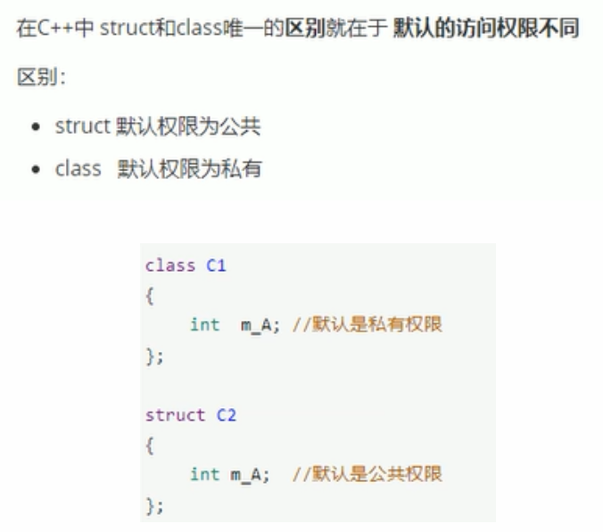
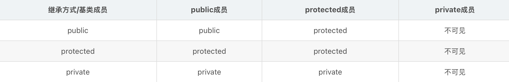
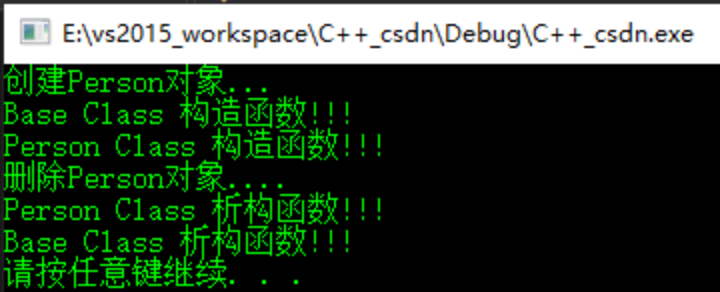
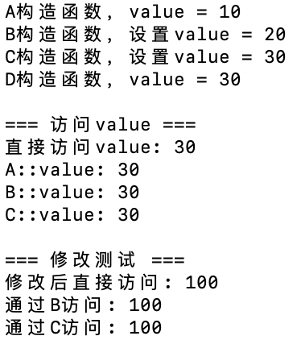
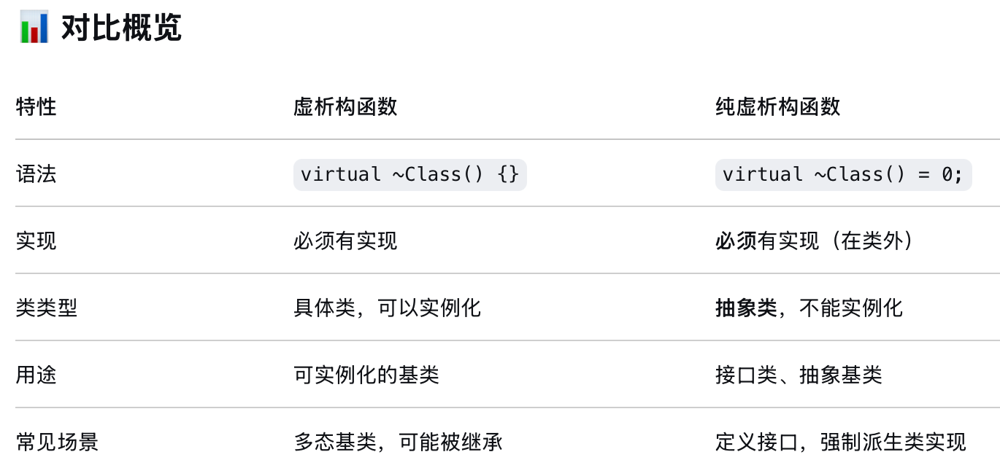
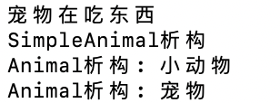
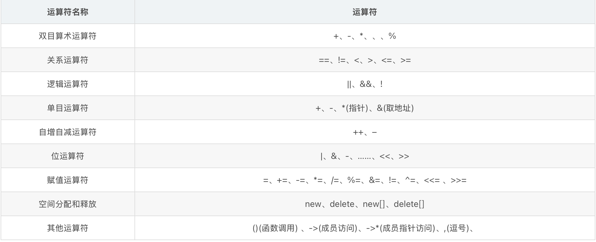
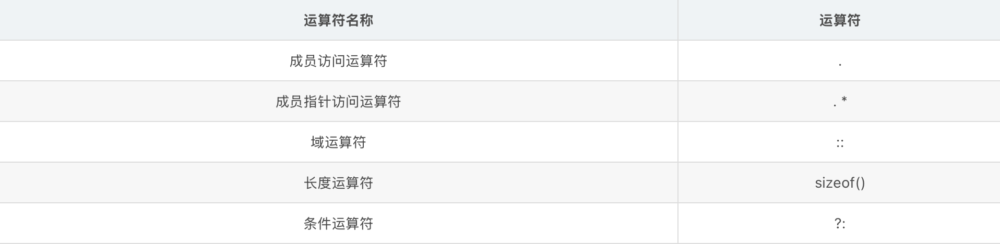
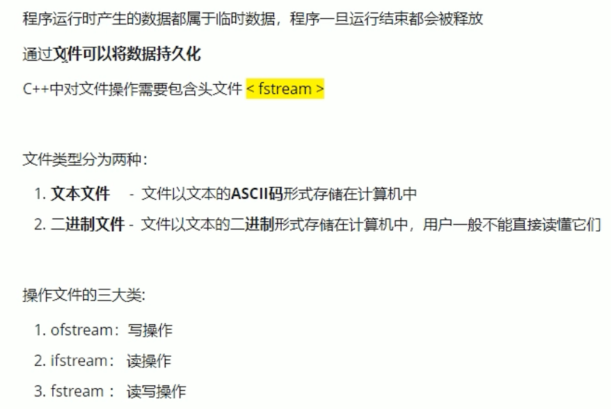

# C++

#### 基本用法

###### 注释

~~~
//单行注释
/*
多行注释
多行注释
*/
~~~

###### 关键字


###### 标识符

- 标识符是用来标识变量、函数、类、模块，或任何其他用户自定义项目的名称。一个标识符以字母 A-Z 或 a-z 或下划线 _ 开始，后跟零个或多个字母、下划线和数字（0-9）。
- 标识符内不允许出现标点字符，比如 @、& 和 %。**C++ 是区分大小写的编程语言**。


###### 数据类型

七种基本的C++数据类型：bool、char、int、float、double、void、wchar_t
类型修饰符：signed、unsigned、short、long
注：一些基本类型可以使用一个或多个类型修饰符进行修饰，比如：signed short int简写为short、signed long int 简写为long。


~~~c++
#include <iostream>
using namespace std;
int main()
{
	bool b;
	char c;short s; int i; long l; long long ll; float f; double d; long double ld;long float lf;
	unsigned char uc; unsigned short us; unsigned int ui; unsigned long ul; unsigned long long ull;
	cout << sizeof(bool) <<  endl;
	cout << sizeof(char)<<" " << sizeof(short)<<" "<< sizeof(signed int) << " " << sizeof(long) << " " << sizeof(signed long long) << " " << sizeof(float) << " " << sizeof(double) << " " << sizeof(long float) << " " << sizeof(long double) << endl;
	cout <<sizeof(unsigned char)<<" "<< sizeof(unsigned short) << " " << sizeof(unsigned int) << " " << sizeof(unsigned long) << " " << sizeof(unsigned long long) << endl;
	cout << sizeof(unsigned) << endl;
	
	
	cout << "hello World!!!" <<endl;
	system("pause");
	return 0;
}
~~~


> [!IMPORTANT]
>
> 数据类型在不同系统中所占空间大小
>
> 这个与机器、操作系统、编译器有关。比如同样是在32bits的操作系统系，VC++的编译器下int类型为占4个字节；而tuborC下则是2个字节。
>
> - c/c++规定int字长和机器字长相同
> - 操作系统字长和机器字长未必一致
> - 编译器根据操作系统字长来定义int字长
>
> 
>
> 注：long类型在不同编译器中的占位不一样： 32位时，VC++和GCC都是4字节； 64位时，VC++是4字节，GCC是8字节


###### typedef声明

~~~
//使用typedef为一个已有的类型取一个新的名字,语法如下：
typedef type newname
//eg：
typedef int feet
feet distance
~~~


###### 枚举类型

C++中的一种派生数据类型，它是由用户定义的若干枚举常量的集合；枚举元素是一个整型，枚举型可以隐式的转换为int型，int型不能隐式的转换为枚举型。

~~~
//枚举类型的语法:
enum 枚举名{
	标识符[=整型常数], 
     标识符[=整型常数], 
... 
    标识符[=整型常数]
}枚举变量;
~~~

如果枚举没有初始化, 即省掉"=整型常数"时, 则从第一个标识符开始;

默认情况下，第一个名称的值为 0，第二个名称的值为 1，第三个名称的值为 2，以此类推。但是，您也可以给名称赋予一个特殊的值，只需要添加一个初始值即可。例如：

~~~
enum course {math,chinese,english,physics,chemistry}c;
c = english;
cout<<c<<endl;  //2
//english为1 physics为2 chemistry为3，chinese仍为1，math仍为0
enum course {math,chinese,english=1,physics,chemistry};
~~~


##### 变量

变量其实只不过是程序可操作的存储区的名称。C++ 中每个变量都有指定的类型，类型决定了变量存储的大小和布局，该范围内的值都可以存储在内存中，运算符可应用于变量上。

###### 变量的声明和定义

- 变量声明向编译器保证变量以给定的类型和名称存在，这样编译器在不需要知道变量完整细节的情况下也能继续进一步的编译。
- 可以在 C++ 程序中多次声明一个变量，但变量只能在某个文件、函数或代码块中被定义一次。
- 多个变量赋同一个值时，需要分别赋值。

~~~c++
int x = y = z = 66;//错误
int x = 3,y = 3,z = 3;
int x, y ,z = 3;
x = y = z;
~~~


~~~c++
// 变量声明
extern int a, b;
int main ()
{
  // 变量定义
  int a, b;
  // 初始化
  a = 23;
  b = 25;
  return 0;
}
~~~

~~~
在 C/C++ 里，这两条语句做的事情完全不同：
extern int a, b;
只作“声明”（declaration）。它告诉编译器“这两个变量在别的翻译单元（别的 .c/.cpp 文件）里已经真正定义了，这里只是让名字可见”。
不会分配存储空间。
可以出现多次，只要所有声明保持一致。
如果整个程序里始终没有一处“定义”（即没有 int a; int b; 之类的定义），链接阶段会报“未解析的外部符号”。
int a, b;
是“定义”（definition）。它同时完成两件事：
向编译器介绍名字 a、b；
为它们分配存储空间（通常放在 .data 或 .bss 段）。
同一个名字在同一个翻译单元里只能有一次定义，否则编译器会报“重复定义”；在整个程序里也只能有一次外部可见的定义（除非用 static 限制为内部链接）。
一句话总结：
extern int a, b; 只是“告诉编译器它们存在”，而 int a, b; 是“真正创建它们”。
~~~

###### 变量的作用域

局部变量：在函数或一个代码块内部声明的变量，称为局部变量。它们只能被函数内部或者代码块内部的语句使用。
全局变量：在所有函数外部定义的变量（通常是在程序的头部），称为全局变量。全局变量的值在程序的整个生命周期内都是有效的。

- 局部变量和全局变量的名称可以相同，但是在函数内，局部变量的值会覆盖全局变量的值。
- 当局部变量被定义时，系统不会对其初始化；定义全局变量时，系统会自动初始化值：`int float double 0，char ’\0‘，指针 NULL`

~~~c++
int i = 66;
int main ()
{
  int i = 88;
  cout << i<<endl;//8
  return 0;
}
float f;
double d;
char c;
int *p;
int main()
{
	cout << i << f << d << c << p << endl;//000 00000000
	return 0
}
~~~

###### -----------------------------------

###### 运算符

~~~
算术运算符：+ - * / % ++ --
关系运算符：== != < > >= <=
逻辑运算符：&& || !
位运算符：& | ^ ~ << >>
赋值运算符：= += -= *= /= %= <<= >>= &= ^= !=
~~~

~~~
杂项运算符：
sizeof            //返回变量的大小，eg:sizeof(a)返回4 a是整型  sizeof(int)
Condition?X:Y     //三元运算符 Condition为true，值为X，否则值为Y
,                //逗号表达式，值为最后一个表达式的值
.和->            //用于引用类、结构和公用体的成员
Cast            //强制类型转换符  eg:int(2.202)返回2
&              //指针运算符 返回变量的地址
*             //指针运算符  指向一个变量
~~~

运算符优先级


##### 语法结构

###### 循环结构

- while

~~~c++
while(conditon)//0为false,非0为true
{
	statement(s);
}
~~~

- for

~~~c++
for(init;conditon;increment)//0为false,非0或什么也不写为true
{
	statement(s);
}
/*
1.init首先被执，且只会执行一次，也可以不写任何语句。
2.然后会判断conditon,true执行循环主体，false跳过循环
3.执行完循环主体，执行increment,跳到2
*/
~~~

~~~c++
int array[5] = { 11, 22, 33, 44, 55 };
for (int x : array)
{
	cout << x << " ";
}
cout << endl;
// auto 类型也是 C++11 新标准中的，用来自动获取变量的类型
for (auto x : array)
{
	cout << x << " ";
}

~~~

- for each
  STL中的for增强循环。

~~~c++
int a[4] = { 4,3,2,1 };
for each (int var in a)
{
	cout << var << " ";
}
~~~

###### 判断结构

- if

~~~c++
if(expr)
{
	statement;//如果expr为true将执行的语句块 
}
if(expr)
{
   statement1;// 如果expr为true将执行的语句块
}
else
{
   statement2;// 如果expr为false将执行的语句
}
if(expr1)
{
   statement1;// 如果expr1为true将执行的语句块
}
elseif(expr2)
{
   statement2;// 如果expr2为true将执行的语句块
}
...
else
{
	statementElse;// 当上面的表达式都为false执行的语句块
}

~~~

- switch

~~~c++
switch(expression){
    case constant-expression  :
       statement(s);
       break; 
    case constant-expression  :
       statement(s);
       break; 
    // 您可以有任意数量的 case 语句
    default : // 可选的
       statement(s);
}
/*
每个case后满的常量表达式必须各不相同。
case语句和default语句出现的顺序对执行结果没有影响。
若case后没有break,执行完就不会判断，继续执行下一个case语句。直到遇到brerak。
default后面如果没有case，则break可以省略
多个case可以用一组执行语句
*/
~~~

~~~
char c = 'A';
	switch (c)
	{
	
	case 'A':
	case 'B':
	case 'C':
		cout << "及格了" << endl;
		break;
	default:
		cout << "不及格" << endl;
	
	}

~~~

###### 三元运算符

~~~
//如果 Exp1 为真，则计算 Exp2 的值，结果即为整个 ? 表达式的值。如果 Exp1 为假，则计算 Exp3 的值，结果即为整个 ? 表达式的值
Exp1 ? Exp2 : Exp3;
~~~

###### 预处理命令

预处理程序（删除程序注释，执行预处理命令等）–>编译器编译源程序

- 宏定义：`#define 标识符 字符串`
- 文件包含：`#include<filename> 或者#include“filename”`
- 条件编译

~~~
//如果标识符被#define定义过，执行程序段1，否则执行程序段2
#ifdef 标识符
	程序段1
#else
	程序段2
#endif
//如果标识符没有被#define定义过，执行程序段1，否则执行程序段2
#ifndef 标识符
	程序段1
#else
	程序段2
#endif
//如果表达式为true，执行程序段1，否则执行程序段2
#if 表达式
	程序段1
#else
	程序段2
#endif

~~~

##### 数组

一些具有相同数据类型或相同属性（类）的数据的集合，用数据名标识，用下标或序号区分各个数据。数组中的数据称为元素。

###### 一维数组

定义一维数组的形式：`数据类型 数据名[常量表达式]`
初始化的形式：`数据类型 数组名[常量表达式] = {初值表};`
为数组的某一个元素赋值：`数组名[下标] =值`(下标从0开始)
数组的引用：`数组名[下标]`

- 初始化数组时，可以只给部分数组元素赋值
- 对全部元素数组赋值时，可以不指定数组长度，编译系统会根据初值个数确定数组的长度。
- static型数组元素不赋初值，系统会自动默认为0。

~~~c++
int arr1[4] = {1,2,3,4};
int arr2[4] = { 1,2 };
int arr[4] = {0};//所有元素为0
static int arr3[3];
int arr4[4];
cout << "arr1:"<<arr1[0] << arr1[1] << arr1[2] << arr1[3] << endl;
cout << "arr2:" << arr2[0] << arr2[1] << arr2[2] << arr2[3] << endl;
cout << "arr3:" << arr3[0] << arr3[1] << arr3[2] << arr3[3] << endl;
cout << "arr4:" << arr4[0] << arr4[1] << arr4[2] << arr4[3] << endl;

~~~


###### 二维数组

定义一维数组的形式：`数据类型 数据名[常量表达式1][常量表达式2]`
初始化的形式：`数据类型 数组名[常量表达式1] [常量表达式2]= {初值表};`
为数组的某一个元素赋值：`数组名[行下标][列下标] =值`(下标从0开始)
数组的引用：`数组名[行下标][列下标]`

- 将所有数据写在一个花括号内，自动按照数组元素个数在内存中排列的顺序赋值
- 可对部分元素赋值，其余元素的值自动取0.
- 定义初始化数组时，可以省略第一维的长度，第二维不能省，系统会自动确认行数

~~~c++
int arr1[2][3];
int arr[2][3] = {0};//所有元素为0
int arr2[2][3] = { {1,2,3},{4,5,6} };
int arr3[2][3] = { 1,2,3 ,4,5,6 };
int arr4[2][3] = { {1},{4,6} };
int arr5[][3] = { 1,2,3 ,4,5,6 };
~~~


###### 字符数组

char类型的数组，在字符数组中最后一位为’\0’）时，可以看成时字符串。在C++中定义了string类，在Visual C++中定义了Cstring类。
字符串中每一个字符占用一个字节，再加上最后一个空字符。如：

~~~c++
//字符串长度为8个字节,最后一位是'\0'。
char array[10] = "yuanrui";//yuanrui\0\0\0
//也可以不用定义字符串长度，如：
char arr[] = "yuanrui";//yuanrui\0
~~~

###### 指向数组的指针

~~~c++
double *p;
double arr[10];
p = arr;//p = &arr[0];
*(p+3);//arr[3]

~~~

###### 数组与new(动态创建数组)

一维数组：

~~~c++
int* arr1 = new int[2];//delete []arr1;
int* arr2 = new int[3]{ 1,2 };//delete []arr2
~~~

二维数组

~~~c++
int m=2, n=3;
int** arr3 = new int*[2];//delete []arr3
for (int i = 0; i < 10; ++i)
{ 
	arr3[i] = new int[3]; // delete []arr3[i]
}
int* arr4 = new int[m*n];//数据按行存储 delete []arr3

~~~

###### 数组与函数

**数组传到函数**

- 如果传递二维数组，形参必须制定第二维的长度。

  ~~~
  形式参数是一个指针：void function(int *param)
  形式参数是一个已定义大小的数组：void function(int param[10])
  形式参数是一个未定义大小的数组：void function(int param[])
  二维数组：void function(int a[][3],int size)
  ~~~

**函数返回数组**

- C++ 不支持在函数外返回局部变量的地址，除非定义局部变量为 static 变量。


~~~
int * function();
int** function();
~~~

##### 函数

函数是实现模块化程序设计思想的重要工具， C++程序中每一项操作基本都是由一个函数来实现的，C++程序中只能有一个主函数（main）

###### 函数声明与定义

- 函数类型-函数的返回值类型；函数名-必须符合C++标识符命名规则，后面必须跟一对括号；函数体-实现函数功能的主题部分；参数列表-函数名后面的括号内，用于向函数传递数值或带回数值。
- 函数声明中，参数名可以省略，参数类型和函数的类型不能省略。
- 函数声明可以放在主调函数内部，放在调用语句之前；也可以放在主调函数外，如果位于所有定义函数之前，后面函数定义顺序任意，各个主调函数调用也不必再做声明
- 当函数定义在前，函数调用灾后，可以不用函数声明。
  

~~~
#函数声明
int max(int a,int b);//声明函数时，a,b可以省略
int max(int,int);
void show();
~~~

~~~
#函数定义
函数类型 函数名(参数列表)
{
	函数体;
}
eg:
int max(int a,int b)
{
	int z;
	z = a>b?a:b;
	return z;
}
~~~

###### 函数的参数与返回值

- 形参：函数定义后面括号里的参数，函数调用前不占内存。
- 实参：函数调用括号里的参数，可以是常量，变量或表达式等。
  **形参和实参必须个数相同、类型一致，顺序一致**
  函数传递方式：传值，指针，引用

~~~
//传值-修改函数内的形式参数对实际参数没有影响
int add(int value)
{
	value++;
	return value;
}
int main()
{
	int v = 10;
	cout << "add() = " << add(v) << endl;//add() = 11
		cout << "v = " << v << endl;//v = 10
	return 0;
}
//指针-修改形式参数会影响实际参数
int add(int* pValue)
{
	(*pValue)++;
	return *pValue;
}
int main()
{
	int v = 10;
	cout << "add() = " << add(&v) << endl;//add() = 11
	cout << "v = " << v << endl;//v = 11
	return 0;
}
//引用-修改形式参数会影响实际参数
int add(int &value)
{
	value++;
	return value;
}
int main()
{
	int v = 10;
	cout << "add() = " << add(v) << endl;//add() = 11
	cout << "v = " << v << endl;//v = 11
	return 0;
}

~~~

###### 有默认值参数的函数

~~~c++
int sum(int a, int b=2)
{
  return (a + b);
}
 
int main ()
{
   cout << "Total value is :" << sum(100, 200);<< endl;//Total value is :300
   cout << "Total value is :" << sum(100);<< endl;//Total value is :102
   return 0;
}
~~~

函数的返回值

- 返回值通过return给出，return后面跟表达式，且只能放回一个值;如果没有表达式，可以不写return；return后面的括号可有可无。
- return语句中的表达式类型应与函数类型一致，否则自动转换类型（函数类型决定返回值类型）

###### 函数调用

- 函数可以单独作为一个语句使用。有返回值的函数，可将函数调用作为语句的一部分，利用返回值参与运算。
  函数调用形式：参数传递–>函数体执行–>返回主调函数

~~~c++
int a()
{
	return 666;
}
int b(int sum)
{
	return sum+a()
}
int main()
{
	cout<<b(222)<<endl;//888
	return 0;
}
~~~

函数的递归调用：直接递归调用和间接递归调用

- 一个函数直接或间接递归调用该函数本身，称为函数的递归调用
- 递归和回归：原问题=>子问题 子问题的解=>原问题的解

~~~c++
//直接递归调用：求1+...n的值
int total(int sum)
{
	if (sum == 1)
	{
		return 1;
	}
	return sum + total(sum - 1);
}
int main()
{
	cout << "total = " << total(10) << endl;//total = 55
	system("pause");
	return 0;
}
//间接递归调用
int f2();
int f1()
{
...
  f2()
}
int f2()
{
	f1();
}

~~~

###### 函数重载

  同一个函数名对应不同的函数实现，每一类实现对应着一个函数体，名字相同，功能相同，只是参数的类型或参数的个数不同。
**多个同名函数只是函数类型（函数返回值类型）不同时，它们不是重载函数**

~~~
int add(int a,int b)
{
	return a+b;
}
double add(double a,double b)
{
	return a+b;
}
int add(int a,int b,int c)
{
	return a+b+c;
}

~~~

###### 内联(inline)函数

  c++在编译时可以讲调用的函数代码嵌入到主调函数中，这种嵌入到主调函数中的函数称为内联函数，又称为内嵌函数或内置函数。

- 定义内联函数时，在函数定义和函数原型声明时都使用inline，也可以只在其中一处使用，其效果一样。
- 内联函数在编译时用内联函数函数的函数体替换,所以不发生函数调用，不需要保护现场，恢复现场，节省了开销。
- 内联函数增加了目标程序的代码量。因此，一般只将函数规模很小且使用频繁的函数声明为内联函数。
- 当内联函数中实现过于复杂时，编译器会将它作为一个普通函数处理,所以内联函数内不能包含循环语句和switch语句。
  内联函数格式如下：

~~~c++
inline 函数类型 函数名(形参列表)
{
	函数体;
}
inline void print(char *s)
{
    printf("%s", s);
}
~~~

##### 字符串

###### C风格的字符串(字符数组)

C风格的字符串实际上是使用 null 字符 ‘\0’ 终止的一维字符数组。

- 输入字符串长度一定小于已定义的字符数组长度，最后一位是/0终止符号；不然输出时无法知道在哪里结束。

  ~~~c++
  char a[5]
  //字符个数不够，补0; 字符个数超过报错
  char str[7] = {'h','e','i','r','e','n'};
  char str[] = {'h','e','i','r','e','n'};
  ~~~

  字符串的处理函数

  ~~~
  strcat(char s1[],const char s2[]);//将s2接到s1上
  strcpy(char s1[],const char s2[]);//将s2复制到s1上
  strcmp(const char s1[],const char s2[]);//比较s1,s2 s1>s2返回1 相等返回1，否则返回-1
  strlen(char s[]);//计算字符串s的长度 字符串s的实际长度，不包括\0在内
  ~~~

###### C++中的字符串(string)

字符串的定义和初始化

~~~
//定义
string 变量;
string str1;
//赋值
string str2 = "ShangHai";
string str3 = str2;
str3[3] = '2';//对某个字符赋值
//字符串数组
string 数组名[常量表达式]
string arr[3];

~~~

> [!IMPORTANT]
>
> 字符串的处理函数

~~~c++
#include <iostream>
using namespace std;
#include <iostream>
#include <algorithm>
#include <string>

int main()
{
    char c_string[7] = {'h','e','i','r','e','n'};
    string str = "Hello World!";

    //string s(str); 生成字符串为str的复制品
    string s(str);
    cout << s << endl; //Hello World!

    //string s(str, strbegin,strlen); 将字符串str中从下标strbegin开始、长度为strlen的部分作为字符串初值
    string s1(str, 1,3);
    cout << s1 << endl; //ell

    //string s(cstr, char_len); 以C_string类型cstr的前char_len个字符串作为字符串s的初值
    string s2(c_string, 3);
    cout << s2 << endl; //hei

    //string s(num ,c); 生成num个c字符的字符串
    string s3(3 ,'c');
    cout << s3 << endl; //ccc

    //size()和length(); 返回string对象的字符个数
    cout << s.size() << endl; //12
    cout << s.length() << endl; //12

    //max_size(); 返回string对象最多包含的字符数，超出会抛出length_error异常
    cout << s.max_size() << endl; //4611686018427387903 c_string无法使用max_size

    //capacity(); 重新分配内存之前，string对象能包含的最大字符数
    cout << s.capacity() << endl; //15 比当前字符长度大的最小的二次幂-1

    //>,>=,<,<=,==,!=//支持string与C-string的比较(如 str<”hello”)。  使用>,>=,<,<=这些操作符的时候是根据“当前字符特性”将字符按字典顺序进行逐一得 比较，string (“aaaa”) <string(aaaaa)。

    //compare();//支持多参数处理，支持用索引值和长度定位子串来进行比较。返回一个整数来表示比较结果，返回值意义如下：0相等 小于1 大于-1：
    cout<< s2.compare(s1) <<endl; //1

    // push_back() 在字符串的最后添加一个字符，只能接字符不能接字符串
    s1.push_back('h');
    cout << s1 << endl; //ellh

    /*
    insert( size_type index, size_type count, CharT ch );//在index位置插入count个字符ch
    insert( size_type index, const CharT* s );//index位置插入一个常量字符串
    insert( size_type index, const CharT* s, size_type n);//index位置插入常量字符串
    insert( size_type index, const basic_string& str );//index位置插入常量string中的n个字符
    insert( size_type index, const basic_string& str, size_type index_str, size_type n);//index位置插入常量str的从index_str开始的n个字符
    insert( size_type index, const basic_string& str,size_type index_str, size_type count = npos);//index位置插入常量str从index_str开始的count个字符，count可以表示的最大值为npos.
    这个函数不构成重载 npos表示一个常数，表示size_t的最大值，string的find函数如果未找到指定字符，返回的就是一个npos
    iterator insert( iterator pos, CharT ch );
    iterator insert( const_iterator pos, CharT ch );
    void insert( iterator pos, size_type n, CharT ch );//迭代器指向的pos位置插入n个字符ch
    iterator insert( const_iterator pos, size_type count, CharT ch );//迭代器指向的pos位置插入count个字符ch
    void insert( iterator pos, InputIt first, InputIt last );
    iterator insert( const_iterator pos, InputIt first, InputIt last );
    */
    s1.insert(2,3,'a');
    cout << s1 << endl; //elaaalh

    // append() 和 + 操作符

    /*访问string每个字符串
    string s1("yuanrui"); // 调用一次构造函数
    // 方法一： 下标法
    for (int i = 0; i < s1.size(); i++)
        cout << s1[i];
    // 方法二：正向迭代器
    for (string::iterator iter = s1.begin();; iter < s1.end();iter++)
        cout << *iter;
    // 方法三：反向迭代器
    for (string::reverse_iterator riter = s1.rbegin(); ; riter < s1.rend();riter++)
        cout << *riter;
    */

    //iterator erase(iterator p); 删除字符串中p所指的字符
    //iterator erase(iterator first, iterator last); 删除字符串中迭代器区间[first,last)上所有字符
    //string& erase(size_t pos = 0, size_t len = npos); 删除字符串中从索引位置pos开始的len个字符
    s2.erase(1,2); //hei
    cout << s2 << endl; //h n可以超过从pos开始的剩余字符数

    //void clear(); 删除字符串中所有字符
    s3.clear();
    cout << s3 << endl; //""

    /*
    string& replace(size_t pos, size_t n, const char *s);//将当前字符串从pos索引开始的n个字符，替换成字符串s
    string& replace(size_t pos, size_t n, size_t n1, char c); //将当前字符串从pos索引开始的n个字符，替换成n1个字符c
    string& replace(iterator i1, iterator i2, const char* s);//将当前字符串[i1,i2)区间中的字符串替换为字符串s
    */

    //tolower()和toupper()函数 或者 STL中的transform算法
    string s4 = "ABCDEFG";
    for( int i = 0; i < s4.size(); i++ )
        s4[i] = tolower(s4[i]);
    cout << s4 << endl; //abcdefg
    transform(s4.begin(),s4.end(),s4.begin(),::toupper);
    cout << s4 << endl; //ABCDEFG

    /*
    * size_t find (constchar* s, size_t pos = 0) const;//在当前字符串的pos索引位置开始，查找子串s，返回找到的位置索引，-1表示查找不到子串
    size_t find (charc, size_t pos = 0) const;//在当前字符串的pos索引位置开始，查找字符c，返回找到的位置索引，-1表示查找不到字符
    size_t rfind (constchar* s, size_t pos = npos) const;//在当前字符串的pos索引位置开始，反向查找子串s，返回找到的位置索引，-1表示查找不到子串
    size_t rfind (charc, size_t pos = npos) const;//在当前字符串的pos索引位置开始，反向查找字符c，返回找到的位置索引，-1表示查找不到字符
    size_t find_first_of (const char* s, size_t pos = 0) const;//在当前字符串的pos索引位置开始，查找子串s的字符，返回找到的位置索引，-1表示查找不到字符
    size_t find_first_not_of (const char* s, size_t pos = 0) const;//在当前字符串的pos索引位置开始，查找第一个不位于子串s的字符，返回找到的位置索引，-1表示查找不到字符
    size_t find_last_of(const char* s, size_t pos = npos) const;//在当前字符串的pos索引位置开始，查找最后一个位于子串s的字符，返回找到的位置索引，-1表示查找不到字符
    size_t find_last_not_of (const char* s, size_t pos = npos) const;//在当前字符串的pos索引位置开始，查找最后一个不位于子串s的字符，返回找到的位置索引，-1表示查找不到子串
     */
    
    //sort(s.begin(),s.end()); 排序
    
    //substr(pos,n);//返回字符串从下标pos开始n个字符
    
}
~~~

###### 指针和引用

> [!IMPORTANT]
>
> ###### 指针
>
> 指针是一个变量，其值为另一个变量的地址。即内存位置的直接地址。声明的一般形式：
>
> - 数据类型是指针变量所指向的变量的数据类型，*表示其后的变量为指针变量
>
> ~~~c++
> 数据类型 *指针变量名;
> int    *ip;    //整型的指针 
> double *dp;    //double 型的指针 
> float  *fp;    //浮点型的指针 
> char   *ch;    //字符型的指针 
> ~~~
>
> 指针变量的初始化：
>
> - &是取地址运算符，&变量名表示变量的地址。
> - 变量的数据类型必须于指针变量的数据类型一致。
> - 为了安全起见，有时会把指针初始化为空指针（NULL或0）
>
> ~~~c++
> 数据类型 *指针变量名 = &变量名;
> *指针变量名 = &变量名;
> int a;
> int *p = &a;
> int *p2;
> p2 = &a;
> ~~~
>

> [!IMPORTANT]
>
> 指针变量的引用：
>
> - & 取地址符 * 指针运算符（间接运算符），其后是指针变量，表示该指针变量所指向的变量。
> - & *的优先级是相同的，结合方式都是自左向右。比如 &*p等价于&(*p)。
>
> ```c++
> int x = 3;
> int y;
> int *p;
> p = &x;
> y = *p;//y = a
> ```
>
> 指针运算（地址运算）
>
> - 算术运算（移动指针运算）：加减，自增自减。
> - p+n运算得到的地址是p+n*sizeof(数据类型)。
> - 两个相同数据类型的指针可以进行加减运算，一般用于数组的操作中。
> - 关系运算：指针指向同一串连续存储单元才有意义，比如数组。与0比较，判断是不是空指针。
> - 赋值运算：变量地址赋值给指针变量，数组元素地址赋值给指针变量，指针变量赋值给其他指针变量。
>   
>   
>
> ```c++
> int arr[10],len;
> int *p1 = &arr[2],*p2 = &arr[5];
>  len = p2-p1;//arr[2] 和arr[5]之间的元素个数 3
> ```
>
> new和delete运算符
>
> - new-为变量分配内存空间；
> - 可以通过判断new返回的指针的值，判断空间是否分配成功。
> - delete-释放空间
>
> ```c++
> 指针变量 = new 数据类型(初值);
> delete 指针变量;
> delete[] 指针变量;//释放为多个变量分配的地址
> ```
>
> 指针与数组
>
> ```
> - 数组名是数组的首地址，eg:arr为arr[0]的地址。
> - 访问数组元素：arr[i]，(arr+i)，(p+i)，p[i]
> - 二维数组：arr+i == &arr[i]，arr[i] == &arr[i][0] ，*(arr[i]+j) == arr[i][j]
> - 指针访问二维数组：指向二维数组元素，指向一维数组
> - 数组指针：数据类型 (*指针变量名) [m]
> ```
>
> ```c++
> int arr[10];
> int *p1 = arr;// *p1 = &arr[0];
> int a[3][5] = { 0 };
> int(*ap)[5];
> ap = a;
> ap+1;//表示下一个一维数组
> ```
>
> 指针与字符串
>
> ```
> 字符串数组名：char ch[] = "heiren";char *p = ch;
> 字符串：char *p = "heiren";
> 指针赋值运算：char * p;p = "Heiren";
> 指针与函数，指针可以作为函数的参数，也可以作为函数的返回值。
> ```
>
> ```c++
> char *p = "heiren";
> cout << p << endl; //heiren
> cout << p+1 << endl; //eiren
> cout << &p << endl; //0x49affff9d8
> ```
>
> 引用
>
> 引用可以看做是数据的一个别名，通过这个别名和原来的名字都能够找到这份数据，类似于window中的快捷方式。
>
> - 引用不占内存空间，**必须在定义的同时初始化**，且不能再引用其他数据。
> - 引用在定义时需要添加&，在使用时不能添加&，使用时添加&表示取地址
>   引用型变量声明：`数据类型 &引用名 = 变量名;`
>
> ```c++
> int a;
> int &b = a;//a和b表示相同的变量，具有相同的地址。
> ```
>
> 引用可以作为函数参数，也可以作为函数返回值。
>
> ```c++
> void swap(int &r1, int &r2) {
>     int temp = r1;
>     r1 = r2;
>     r2 = temp;
> }
> int &add1(int &r) {
> 	r += 1;
> 	return r;
> }
> int main()
> {
> 	int a = 12;
> 	int b = add1(a);
> 	cout << a << "   "<<b << endl;//13  13
> 	return 0;
> }
> 
> ```
>
> a、b同时变
>
> **将引用作为函数返回值时不能返回局部数据的引用，因为当函数调用完成后局部数据就会被销毁。**
> 函数在栈上运行，函数掉用完，后面的函数调用会覆盖之前函数的局部数据。
>
> ```c++
> int &add1(int &r) {
> 	r += 1;
> 	int res = r;
> 	return res;
> }
> 
> int main()
> {
> 	int a = 12;
> 	int &b = add1(a);
> 	int &c = add1(a);
> 	cout << a << "   "<<b <<" "<< c<<endl;//14   -858993460 -858993460
> 	return 0;
> }
> 
> ```
>
> ```c++
> int &add1(int &r) {
>     r += 1;
>     return r;
> }
> 
> int main()
> {
>     int a = 12;
>     int &b = add1(a);
>     int &c = add1(a);
>     cout << a << " "<<b <<" "<< c<<endl;//14 14 14
>     return 0;
> }
> ```

##### 自定义数据类型

###### 结构体

结构体可以包含不同数据类型的结构。
定义结构体的一般形式

```c++
struct 结构体类型名
{
	成员类型1 成员名1;
	成员类型2 成员名2;
	... ...
	成员类型n 成员名n;
};

```

结构体变量名的定义和初始化：

同时声明结构体变量名

```c++
struct 结构体类型名
{
	成员类型1 成员名1;
	成员类型2 成员名2;
	... ...
	成员类型n 成员名n;
}变量名1,变量名2,...变量名n;

eg.

struct  person
{
	int year;
	int age;
	string name;
}p1 = {2019,24,"heiren"}, p1 = { 2020,24,"heiren" };
```

先定义结构体再定义变量名

```c++
struct  person
{
	int year;
	int age;
	string name;
};
struct person p1 = { 2019,24,"heiren" }, p1 = { 2020,24,"heiren" };
```

结构体变量的使用：

- 具有相同类型的结构体变量可以进行赋值运算，但是不能输入输出
- 对结构体变量的成员引用：`结构体变量名.成员名`
- 指向结构体的指针变量引用格式：`指针变量名->成员名;`
  结构体数组的定义，初始化和使用与结构体变量、基本类型数组相似

```c++
struct person
{
	int year;
	int age;
	string name;
}p[2] ={ {2019,24,"heiren"}, { 2020,24,"heiren" }};//可以不指定数组元素个数
```

结构体作为函数传递有三种：值传递，引用传递，指针传递

###### 公用体(union)

几个不同的变量共享同一个地址开始的内存空间。

- 成员类型可以是基本数据类型，也可以是构造数据类型。
- 公用体变量初始化时，只能对第一个成员赋值。
- 公用体变量所占的内存长度等于最长的成员长度。
- 公用体变量在一个时刻只能一个成员发挥作用，赋值时，成员之间会互相覆盖，最后一次被赋值的成员起作用。
  定义

```c++
union data
{
	int i;
	float f;
	char c;
}x = {12};
int main()
{
	cout << x.i << " " << x.f << " " << x.c << endl;//12 1.68156e-44 
	x.c = 'c';
	cout << x.i <<" "<< x.f << " " << x.c << endl;//99 1.38729e-43 c
	return 0;
}
```

```
把这段代码当成“看同一块 4 字节内存的三种眼镜”就能秒懂：  
union 只分配 **4 字节**（最大成员 int），i / f / c 完全重叠。  
`x = {12};` 只给第一个成员 i 写 12，其余成员并没有“被初始化”，而是“刚好躺在同一串位模式上”。  
后面两次 cout 只是把那段位模式分别用 int / float / char 的眼镜再解释一遍。

------------------------------------------------
第一次输出  
内存里的位模式（小端机器）：  
`0x0000000C`   // 十六进制  
`00000000 00000000 00000000 00001100`  // 二进制

- 用 int 眼镜看：就是 12 → 输出 12  
- 用 float 眼镜看：把 `0x0000000C` 当成 IEEE-754 单精度  
  符号 0，指数 0，尾数 0x00000 → 规格化最小正数  
  值 = 1.4 × 2⁻¹⁴⁹ ≈ 1.68156e-44  
- 用 char 眼镜看：只取最低 1 字节 `0x0C` → ASCII 12 对应“换页符”(FF)，属于不可显控制字符，cout 打印出来就是空白，所以只看到  
`12 1.68156e-44 `（c 列看起来“丢了”，其实是输出了但看不见）。

------------------------------------------------
第二次 `x.c = 'c';`  
'c' 的 ASCII 码是 99 = 0x63，指令只改写 **最低字节**，内存变成  
`0x00000063`  
`00000000 00000000 00000000 01100011`

- int 眼镜：0x00000063 = 99 → 输出 99  
- float 眼镜：0x00000063 对应的 IEEE-754  
  符号 0，指数 0，尾数 0x00006 → 仍是非常小的规格化数  
  值 ≈ 1.38729e-43  
- char 眼镜：直接就是 0x63 → 'c'，可见字符，于是看到  
`99 1.38729e-43 c`

------------------------------------------------
一句话总结  
union 里所有成员共享同一块内存；  
你给谁赋值，谁就“写”那段位模式；  
读谁，就把那段位模式按谁的类型重新解码。  
第一次 12 只写高 3 字节为 0，最低字节为 0x0C；  
第二次只把最低字节改成 0x63，高 3 字节仍是 0，于是 int 变成 99，float 跟着位模式变成另一个极小值，char 变成 'c'。
```

##### 面向对象

###### 类

类的声明

```c++
class 类名
{
	public:
		公有数据成员;
		公有成员函数;
	private:
		私有数据成员;
		私有成员函数;
	protected:
		保护数据成员;
		保护成员函数;
};
```

成员函数的定义：类内，类外，类外内联函数

```c++
//类外
返回类型 类名:成员函数名(参数列表)
{
	函数体;
}
//内联函数：类外
inline 返回类型 类名:成员函数名(参数列表)
{
	函数体;
}
```

**内联函数的代码会直接嵌入到主调函数中，可以节省调用时间，如果成员函数在类内定义，自动为内联函数。**


###### Class和Struct的区别



```c++
//结构体默认权限为public，如果换成class会报错
struct person
{
	string name;
	int age;
};
int main()
{
	person p;
	p.name = "heiren";
	p.age = 666;
	cout <<"name="<< p.name <<" age="<< p.age << endl;
	return 0;
}
```


###### 类成员的访问权限以及类的封装

- 和Java、C#不同的是，C++中public、private、protected只能修饰类的成员，不能修饰类，C++中的类没有共有私有之分
- 类内部没有访问权限的限制，都可以互相访问。
- 在C++中用class定义的类中，其成员的默认存取权限是private。


###### 对象

```c++
//1.声明类同时定义对象
class 类名
{
	类体;
}对象名列表;
//2.先声明类，再定义对象
类名 对象名(参数列表);//参数列表为空时，()可以不写
//3. 不出现类名，直接定义对象
class 
{
	类体;
}对象名列表;
//4.在堆上创建对象
Person p(123, "yar");//在栈上创建对象
Person *pp = new Person(234,"yar");//在堆上创建对象
```

**注：不可以在定义类的同时对其数据成员进行初始化，因为类不是一个实体，不合法但是能编译运行**
对象成员的引用：`对象名.数据成员名 或者 对象名.成员函数名(参数列表)`

###### 构造函数

是一种特殊的成员函数，主要功能是为对象分配存储空间，以及为类成员变量赋初值

- 构造函数名必须与类名相同
- 没有任何返回值和返回类型
- 创建对象自动调用，不需要用户来调用，且只调用一次
- 类没有定义任何构造函数，编译系统会自动为这个类生成一个默认的无参构造函数
  构造函数定义

```c++
//1.类中定义 2.类中声明，类外定义
[类名::]构造函数名(参数列表)
{
	函数体
}
//创建对象
类名 对象名(参数列表);//参数列表为空时，()可以不写

class Person
{
public:
	Person(int = 0,string = "张三");
	void show();
private:
	int age;
	string name;
};
Person::Person(int a, string s)
{
	cout<<a<<" "<<s<<endl;
	age = a;
	name = s;
}
void Person::show()
{
	cout << "age="<<age << endl;
	cout << "name=" <<name << endl;
}
int main()
{
  Person p; //0 张三
	Person p2(12);//12 张三
	Person p3(123, "yar");//123 yar
	return 0;
}

```

带参数初始化表的构造函数

```c++
类名::构造函数名(参数列表):参数初始化表
{
	函数体;
}
参数初始化列表的一般形式：
参数名1(初值1),参数名2(初值2),...,参数名n(初值n)
  
class Person
{
public:
	Person(int = 0,string = "张三");
	void show();
private:
	int age;
	string name;
};
Person::Person(int a, string s):age(a),name(s)
{
	cout << a << " " << s << endl;
}

```

###### 拷贝构造函数

```c++
类名::类名(类名&对象名)
{
	函数体;
}

class Person
{
public:
    Person(Person &p);//声明拷贝构造函数
    Person(int = 0,string = "张三");
    void show();
private:
    int age;
    string name;
};
Person::Person(Person &p)//定义拷贝构造函数
{
    cout << "拷贝构造函数" << endl;
    p.age = 0;
    p.name = "ABC";
}
Person::Person(int a, string s):age(a),name(s)
{
    cout << a << " " << s << endl;
}
void Person::show()
{
    cout << age << " " << name << endl;
}
int main()
{
    Person p(123, "yar");
    Person p2(p);
    p2.show();
    p.show();
    return 0;
}
输出：
123 yar
拷贝构造函数
0
0 ABC
```

```c++
class Person
{
public:
    Person(Person &p);//声明拷贝构造函数
    Person(int = 0,string = "张三");
    void show();
private:
    int age;
    string name;
};
Person::Person(Person &p)//定义拷贝构造函数
{
    cout << "拷贝构造函数" << endl;
    age = 0;
    name = "ABC";
}
Person::Person(int a, string s):age(a),name(s)
{
    cout << a << " " << s << endl;
}
void Person::show()
{
    cout << age << " " << name << endl;
}
int main()
{
    Person p(123, "yar");
    Person p2(p);
    p2.show();
    p.show();
    return 0;
}
输出：
123 yar
拷贝构造函数
0 ABC
123 yar
（不会完全拷贝）
```

> [!IMPORTANT]
>
> 调用默认构造函数的时候，不要加()，因为编译器会以为是函数的声明


###### 析构函数

是一种特殊的成员函数，当对象的生命周期结束时，用来释放分配给对象的内存空间爱你，并做一些清理的工作。

- 析构函数名与类名必须相同。
- 析构函数名前面必须加一个波浪号~。
- 没有参数，没有返回值，不能重载。
- 一个类中只能有一个析构函数。
- 没有定义析构函数，编译系统会自动为和这个类生成一个默认的析构函数。

析构函数的定义：

```c++
//1.类中定义 2.类中声明，类外定义
[类名::]~析构函数名()
{
	函数体;
}
```


###### 对象指针

对象指针的声明和使用

~~~c++
类名 *对象指针名;
对象指针 = &对象名;

//访问对象成员
对象指针->数据成员名
对象指针->成员函数名(参数列表)

Person p(123, "yar");
Person* pp = &p;

Person* pp2 = new Person(234,"yar")
pp->show();
~~~

指向对象成员的指针

--------------------------------------------------
1. 指向数据成员的指针  
语法：  
数据成员类型 *指针变量名 = &对象名.数据成员名;

```cpp
#include <iostream>
struct Girl {
    int age = 18;
};
int main() {
    Girl g;                       // 对象
    int Girl::*pAge = &Girl::age; // 指向数据成员的指针
    std::cout << g.*pAge << '\n'; // 通过对象解引用
}
```

--------------------------------------------------
2. 指向成员函数的指针（声明）  
语法：  
函数类型 (类名::*指针变量名)(参数列表);

```cpp
#include <iostream>
struct Calculator {
    int square(int x) { return x * x; }
};
int main() {
    // 声明一个指向 Calculator 成员函数的指针
    int (Calculator::*pf)(int);
}
```

--------------------------------------------------
3. 给成员函数指针赋值  
语法：  
指针变量名 = &类名::成员函数名;

```cpp
#include <iostream>
struct Calculator {
    int square(int x) { return x * x; }
};
int main() {
    int (Calculator::*pf)(int);   // 声明
    pf = &Calculator::square;     // 赋值
}
```

--------------------------------------------------
4. 通过对象调用成员函数指针  
语法：  
(对象名.*指针变量名)(参数列表);

```cpp
#include <iostream>
struct Calculator {
    int square(int x) { return x * x; }
};
int main() {
    int (Calculator::*pf)(int) = &Calculator::square;
    Calculator c;
    std::cout << (c.*pf)(7) << '\n'; // 输出 49
}
```


this指针

每个成员函数都有一个特殊的指针this，它始终指向当前被调用的成员函数操作的对象

~~~c++
class Person
{
public:
	Person(int = 0,string = "张三");
	void show();
private:
	int age;
	string name;
};
Person::Person(int a, string s):age(a),name(s)
{
	cout << a << " " << s << endl;
}
void Person::show()
{
	cout << "age="<<this->age << endl;
	cout << "name=" <<this->name << endl;
}

~~~

###### 静态成员

以关键字static开头的成员为静态成员，多个类共享。

- static 成员变量属于类，不属于某个具体的对象

- 静态成员函数只能访问类中静态数据成员

- 在代码运行前就分配了内存

  静态数据成员

~~~c++
//类内声明，类外定义
class xxx
{
	static 数据类型 静态数据成员名;
}
数据类型 类名::静态数据成员名=初值
//访问
类名::静态数据成员名;
对象名.静态数据成员名;
对象指针名->静态数据成员名;
~~~

静态成员函数

~~~c++
//类内声明，类外定义
class xxx
{
	static 返回值类型 静态成员函数名(参数列表);
}
返回值类型 类名::静态成员函数名(参数列表)
{
	函数体;
}
//访问
类名::静态成员函数名(参数列表);
对象名.静态成员函数名(参数列表);
对象指针名->静态成员函数名(参数列表);
~~~


###### 友元

借助友元(friend)，可以使得其他类中得成员函数以及全局范围内得函数访问当前类的private成员。
友元函数

- 友元函数不是类的成员函数，所以没有this指针，必须通过参数传递对象。
- 友元函数中不能直接引用对象成员的名字，只能通过形参传递进来的对象或对象指针来引用该对象的成员。
  

~~~c++
//1.将非成员函数声明为友元函数
#include <iostream>
#include <string>
using  namespace std;

class Person
{
public:
	Person(int = 0,string = "张三");//带默认参数的构造函数
	friend void show(Person *pper);//将show声明为友元函数
private:
	int age;
	string name;
};
Person::Person(int a, string s):age(a),name(s)
{
	cout << a << " " << s << endl;
}
void show(Person *pper)
{
	cout << "age="<< pper->age << endl;
	cout << "name=" << pper->name << endl;
}
int main()
{
	Person *pp = new Person(234,"yar");
	show(pp);

    Person *p1 = new Person();
    show(p1);
	return 0;

    cout << p1.age << endl; //错误，age是私有成员
}

~~~

```c++
#include <iostream>
#include <string>
using  namespace std;

class Person2; // 提前声明

class Person1 {
public:
    Person1(string n, int a) : name1(n), age1(a) {};
    void display(Person2 *p2); //声明一个用于访问Person2私有成员的函数 
private:
    string name1;
    int age1;
};

class Person2 {
public:
    Person2(string n, int a) : name2(n), age2(a) {}
    friend void Person1::display(Person2 *p2);//声明上面要访问自己私有成员的函数为友元函数
private:
    string name2;
    int age2;
};

void Person1::display(Person2 *p2) {
    cout << "Name: " << p2->name2 << ", Age: " << p2->age2 << endl;
}


int main() {
    Person1 p("Alice", 30);
    Person2 *q = new Person2("Bob", 25);
    p.display(q);
    return 0;
}
```


> [!IMPORTANT]
>
> ```
> 1.Person2要提前声明
> 2.在Person1中声明一个要访问Person2的函数
> 3.在Person2中声明Person1中要访问自己的函数为友元函数
> 4.友元函数通过对象指针进行访问私有成员
> ```


##### 继承和派生

###### 继承和派生概述

继承就是再一个已有类的基础上建立一个新类，已有的类称基类或父类，新建立的类称为派生类和子类；派生和继承是一个概念，角度不同而已，继承是儿子继承父亲的产业，派生是父亲把产业传承给儿子。

- 一个基类可以派生出多个派生类，一个派生类可以继承多个基类
  派生类的声明：

```c++
//继承方式为可选项，默认为private，还有public,protected
class 派生类名：[继承方式]基类名
{
	派生类新增加的成员声明;
};
```

继承方式：

- public-基类的public成员和protected成员的访问属性保持不变，私有成员不可见。
- private-基类的public成员和protected成员成为private成员,只能被派生类的成员函数直接访问，私有成员不可见。
- protected-基类的public成员和protected成员成为protected成员,只能被派生类的成员函数直接访问，私有成员不可见。
  



- 利用using关键字可以改变基类成员再派生类中的访问权限；using只能修改基类中public和protected成员的访问权限。

```c++
class Base
{
public:
	void show();
protected:
	int aa;
	double dd;
};
void Base::show(){
}
class Person:public Base
{
public:
	using Base::aa;//将基类的protected成员变成public
	using Base::dd;//将基类的protected成员变成public
private:
	using Base::show;//将基类的public成员变成private
	string name;
};
int main()
{
	Person *p = new Person();
	p->aa = 12;
	p->dd = 12.3;
	p->show();//出错
	delete p;
	return 0;
}

```

派生类的构造函数和析构函数

- 先执行基类的构造函数，随后执行派生类的构造函数
- 先执行派生类的析构函数，再执行基类的析构函数。
- 派生类的构造函数：==`派生类名(总参数列表)：基类名(基类参数列表),子对象名1(参数列表){构造函数体;}`==

```c++
class Base
{
public:
	Base(int, double);
	~Base();
private:
	int aa;
	double dd;
};
Base::Base(int a, double d) :aa(a), dd(d)
{
	cout << "Base Class 构造函数!!!" << endl;
}
Base::~Base()
{
	cout << "Base Class 析构函数!!!" << endl;
}
class Person:public Base
{
public:
	Person(int,double,string);
	~Person();
private:
	string name;
};
Person::Person(int a,double d,string str):Base(a,d),name(str)
{
	cout << "Person Class 构造函数!!!" << endl;
}
Person::~Person()
{
	cout << "Person Class 析构函数!!!" << endl;
}
int main()
{
	cout << "创建Person对象..." << endl;
	Person *p = new Person(1,2,"yar");
	cout << "删除Person对象...." << endl;
	delete p;
	system("pause");
	return 0;
}

```



###### 多继承

一个派生类可以同时继承多个基类

多继承容易让代码逻辑复杂、思路混乱，一直备受争议，中小型项目中较少使用，后来的 Java、C#、PHP 等干脆取消了多继承。

多重继承派生类声明的一般形式：

```c++
class 派生类名:继承方式1 基类1,继承方式2 基类2
{
	派生类主体;
};
```

多重继承派生类的构造函数:

```c++
派生类名(总参数列表)：基类名1(基类参数列表1),基类名2(基类参数列表2),
子对象名1,...(参数列表)
{
	构造函数体;
}；
```

二义性问题：多个基类中有同名成员，出现访问不唯一的问题。

- 1.`类名::同名成员名;`
- 2.派生类定义同名成员，访问的就是派生类同名成员。


###### 虚基类

c++引入虚基类使得派生类再继承间接共同基类时只保留一份同名成员。

- 虚继承的目的是让某个类做出声明，承诺愿意共享它的基类。其中，这个被共享的基类就称为虚基类（Virtual Base Class）。
- 派生类的 同名成员 比虚基类的 优先级更高
  虚基类的声明：`class 派生类名:virtual 继承方式 基类名`

```c++
#include <iostream>
#include <string>
using  namespace std;

class A {
public:
    int value;  // 同名成员变量
    A() : value(10) {
        cout << "A构造函数，value = " << value << endl;
    }
};

// B虚继承A
class B : virtual public A {
public:
    B() {
        value = 20;  // 修改A的value
        cout << "B构造函数，设置value = " << value << endl;
    }
};

// C虚继承A
class C : virtual public A {
public:
    C() {
        value = 30;  // 也修改A的value（同一个！）
        cout << "C构造函数，设置value = " << value << endl;
    }
};

// D继承B和C
class D : public B, public C {
public:
    D() {
        cout << "D构造函数，value = " << value << endl;
    }
    
    void show() {
        cout << "\n=== 访问value ===" << endl;
        cout << "直接访问value: " << value << endl;  // 访问A的value
        
        // 查看不同路径的value（都是同一个）
        cout << "A::value: " << A::value << endl;
        cout << "B::value: " << B::value << endl;
        cout << "C::value: " << C::value << endl;
    }
};

int main() {
    D d;
    d.show();
    
    // 修改测试
    cout << "\n=== 修改测试 ===" << endl;
    d.value = 100;  // 直接修改
    cout << "修改后直接访问: " << d.value << endl;
    cout << "通过B访问: " << d.B::value << endl;
    cout << "通过C访问: " << d.C::value << endl;
    
    return 0;
}

```



##### 多态和虚函数

###### 向上转型

数据类型的转换，编译器会将小数部分直接丢掉（不是四舍五入）

```c++
int a = 66.9;
printf("%d\n", a);//66
float b = 66;
printf("%f\n", b);//66.000000
```

- 只能将将派生类赋值给基类（C++中称为向上转型）： 派生类对象赋值给基类对象、将派生类指针赋值给基类指针、将派生类引用赋值给基类引用
- 派生类对象赋值给基类对象，舍弃派生类新增的成员；派生类指针赋值给基类指针，没有拷贝对象的成员，也没有修改对象本身的数据，仅仅是改变了指针的指向；派生类引用赋值给基类引用，和指针的一样。
  

==上转型后通过基类的对象、指针、引用只能访问从基类继承过去的成员（包括成员变量和成员函数），不能访问派生类新增的成员==


###### 多态

不同的对象可以使用同一个函数名调用不同内容的函数

多态分为两类

- 静态多态：==函数重载==和==运算符重载==属于静态多态，复用函数名
- 动态多态：==派生类==和==虚函数==实现运行时多态

静态多态和动态多态区别：

- 静态多态的函数地址早绑定 - 编译阶段确定函数地址
- 动态多态的函数地址晚绑定 - 运行阶段确定函数地址

**编译时多态（静态多态）**

```c++
#include <iostream>
using namespace std;

// 函数重载 - 编译时多态
class Calculator {
public:
    // 同名函数，参数不同
    int add(int a, int b) {
        cout << "整数相加: ";
        return a + b;
    }
    
    double add(double a, double b) {
        cout << "浮点数相加: ";
        return a + b;
    }
    
    string add(string a, string b) {
        cout << "字符串拼接: ";
        return a + b;
    }
};

// 运算符重载 - 编译时多态
class Vector {
public:
    int x, y;
    
    Vector(int x, int y) : x(x), y(y) {}
    
    // 重载+运算符
    Vector operator+(const Vector& other) {
        return Vector(x + other.x, y + other.y);
    }
    
    // 重载<<运算符
    friend ostream& operator<<(ostream& os, const Vector& v) {
        os << "(" << v.x << ", " << v.y << ")";
        return os;
    }
};

int main() {
    Calculator calc;
    cout << calc.add(1, 2) << endl;      // 调用int版本
    cout << calc.add(1.5, 2.5) << endl;  // 调用double版本
    cout << calc.add("Hello", " World") << endl; // 调用string版本
    
    Vector v1(1, 2), v2(3, 4);
    Vector v3 = v1 + v2;  // 运算符重载
    cout << v1 << " + " << v2 << " = " << v3 << endl;
    
    return 0;
}
```

**运行时多态（动态多态）**

```c++
#include <iostream>
using namespace std;

// 基类 - 定义接口
class Animal {
public:
    // 虚函数 - 实现多态的关键
    virtual void speak() const {
        cout << "动物发出声音" << endl;
    }
    
    virtual ~Animal() {}  // 虚析构函数
};

// 派生类1
class Dog : public Animal {
public:
    void speak() const override {  // 重写基类虚函数
        cout << "汪汪汪！" << endl;
    }
    
    void wagTail() {
        cout << "摇尾巴" << endl;
    }
};

// 派生类2
class Cat : public Animal {
public:
    void speak() const override {
        cout << "喵喵喵！" << endl;
    }
    
    void scratch() {
        cout << "挠痒痒" << endl;
    }
};

// 派生类3
class Bird : public Animal {
public:
    void speak() const override {
        cout << "叽叽喳喳！" << endl;
    }
    
    void fly() {
        cout << "展翅高飞" << endl;
    }
};

void makeAnimalSpeak(const Animal& animal) {
    animal.speak();  // 同一调用，不同行为
}

int main() {
    Dog dog;
    Cat cat;
    Bird bird;
    
    cout << "=== 直接调用 ===" << endl;
    dog.speak();  // 汪汪汪！
    cat.speak();  // 喵喵喵！
    bird.speak(); // 叽叽喳喳！
    
    cout << "\n=== 通过基类指针调用 ===" << endl;
    Animal* animals[] = {&dog, &cat, &bird};
    
    for (int i = 0; i < 3; i++) {
        animals[i]->speak();  // 运行时决定调用哪个speak()
    }
    
    cout << "\n=== 通过基类引用调用 ===" << endl;
    makeAnimalSpeak(dog);   // 汪汪汪！
    makeAnimalSpeak(cat);   // 喵喵喵！
    makeAnimalSpeak(bird);  // 叽叽喳喳！
    
    return 0;
}
```

###### 虚函数

实现程序多态性的一个重要手段，使用基类对象指针访问派生类对象的同名函数

- 将基类中的函数声明为虚函数，派生类中的同名函数自动为虚函数。
- 声明形式：`virtual 函数类型 函数名 (参数列表);`
- ==构造函数不能声明为虚函数，析构函数可以声明为虚函数。==

```c++
#include <iostream>
#include <string>
using  namespace std;

class  A
{
public:
	virtual void show()
	{
		cout << "A show" << endl;
	}
};
class B:  public A
{
public:
	void show()
	{
		cout << "B show" << endl;
	}
};

class C : public A{
public:
    void show()
    {
        cout << "C show" << endl;
    }
};

int main()
{
	B b;
	b.show();//B show
	A *pA = &b;
	pA->show();//B show 如果show方法前没用virtual声明为虚函数，这里会输出A show
  C c;
  A *pA2 = &c;
  pA2->show();//C show
	return 0;
}
```

###### 纯虚函数

在基类中不执行具体的操作，只为派生类提供统一结构的虚函数，将其声明为虚函数。

```c++
纯虚函数语法：
virtual 返回值类型 函数名（参数列表）= 0；
```

```c++
class  A
{
public:
	virtual void show() = 0;
};
class B:  public A
{
public:
	void show()
	{
		cout << "B show" << endl;
	}
};
```

抽象类：包含纯虚函数的类称为抽象类。由于纯虚函数不能被调用，所以不能利用抽象类创建对象，又称抽象基类。

抽象类特点：

- 无法实例化对象
- 子类必须重写抽象类中的纯虚函数，否则也属于抽象类

###### 虚析构和纯虚析构

多态使用时，如果子类中有属性开辟到堆区，那么父类指针在释放时无法调用到子类的析构代码

解决方案：将父类中的析构函数改为==虚析构==或者==纯虚析构==

虚析构和纯虚析构共性：

- 可以解决父类指针释放子类对象
- 都需要有具体的函数实现

虚析构和纯虚析构区别：

- 如果是纯虚析构，该类属于抽象类，无法实例化对象



虚函数案例

```c++
#include <iostream>
using namespace std;

class Animal {
protected:
    string name;
    int age;
public:
    Animal(string n, int a) : name(n), age(a) {}
    
    // 虚析构函数 - 因为Animal可能被继承
    virtual ~Animal() {
        cout << "Animal析构: " << name << endl;  // 这里输出的！
    }
    
    void eat() {
        cout << name << "在吃东西" << endl;
    }
    
    virtual void makeSound() {
        cout << name << "发出声音" << endl;
    }
};

class SimpleAnimal : public Animal {
public:
    SimpleAnimal(string n, int a) : Animal(n, a) {}
    
    ~SimpleAnimal() override {
        cout << "SimpleAnimal析构" << endl;
    }
};

int main() {
    // Animal可以直接实例化
    Animal pet("宠物", 2);
    pet.eat();
    
    // 也可以通过基类指针使用
    Animal* animal = new SimpleAnimal("小动物", 1);
    delete animal;  // ✅ 正确调用子类析构函数
    
    return 0;
}
```



> [!IMPORTANT]
>
> **当父类的析构函数是虚函数时：**
>
> 1. 用父类指针指向子类对象
> 2. 释放该指针时（`delete`）
> 3. **先调用子类的析构函数**
> 4. **再调用父类的析构函数**


纯虚函数案例：

```c++
#include <iostream>
#include <string>
using  namespace std;


class Animal {
public:
    Animal() {
        cout << "Animal构造函数" << endl;
    }
    
    // 纯虚析构函数 - 注意这里！
    virtual ~Animal() = 0;  // 声明为纯虚
    
    virtual void speak() = 0;  // 普通纯虚函数
};

// 纯虚析构函数必须提供实现！
Animal::~Animal() {
    cout << "Animal纯虚析构函数（实际被调用了！）" << endl;
}

class Dog : public Animal {
private:
    string* namePtr;
public:
    Dog(string name) {
        namePtr = new string(name);
        cout << "Dog构造函数: " << *namePtr << endl;
    }
    
    ~Dog() override {
        cout << "Dog析构函数开始，名字: " << *namePtr << endl;
        delete namePtr;
        cout << "Dog析构函数结束" << endl;
    }
    
    void speak() override {
        cout << *namePtr << "说: 汪汪！" << endl;
    }
};

int main() {
    cout << "=== 测试纯虚析构函数的调用顺序 ===" << endl;
    
    Animal* pet = new Dog("小黑");
    pet->speak();
    
    cout << "\n删除对象..." << endl;
    delete pet;  // 会发生什么？
    
    return 0;
}
```


> [!IMPORTANT]
>
> 普通纯虚函数可以不实现（使用父类），纯虚析构函数必须实现（使用父类）

```c++
#include <iostream>
using namespace std;

class Animal {
public:
    // 纯虚函数 - 父类不提供实现
    virtual void speak() = 0;  // ✅ 父类可以不实现
    
    virtual void eat() {       // 普通虚函数，有默认实现
        cout << "动物在吃东西" << endl;
    }
    
    virtual ~Animal() {}
};

// ❌ 错误：尝试为纯虚函数提供实现是不必要的
// void Animal::speak() { }  // 可以但不必须

class Dog : public Animal {
public:
    // ✅ 子类必须实现纯虚函数
    void speak() override {
        cout << "汪汪！" << endl;
    }
    
    // 可以选择重写eat()，也可以使用父类的默认实现
};

class Cat : public Animal {
public:
    // ✅ 子类必须实现纯虚函数
    void speak() override {
        cout << "喵喵！" << endl;
    }
    
    // 重写eat()
    void eat() override {
        cout << "猫在吃鱼" << endl;
    }
};

// ❌ 错误：没有实现所有纯虚函数的类也是抽象类
class AbstractBird : public Animal {
    // 没有实现speak() → 这个类也是抽象类
public:
    void fly() {
        cout << "鸟儿在飞" << endl;
    }
};

// ✅ 正确：实现纯虚函数后成为具体类
class ConcreteBird : public AbstractBird {
public:
    void speak() override {  // 在这里实现
        cout << "叽叽喳喳！" << endl;
    }
};

int main() {
    Dog dog;
    dog.speak();  // 汪汪！
    dog.eat();    // 动物在吃东西（使用父类默认实现）
    
    Cat cat;
    cat.speak();  // 喵喵！
    cat.eat();    // 猫在吃鱼（使用子类重写）
    
    // AbstractBird bird;  // ❌ 错误：抽象类不能实例化
    // bird.speak();       // 因为没有实现speak()
    
    ConcreteBird bird;
    bird.speak();  // 叽叽喳喳！
    bird.fly();    // 鸟儿在飞
    
    return 0;
}
```


##### 运算符重载

所谓重载，就是赋予新的含义。函数重载（Function Overloading）可以让一个函数名有多种功能，在不同情况下进行不同的操作。运算符重载（Operator Overloading）也是一个道理，同一个运算符可以有不同的功能。

- 运算符重载是通过函数实现的，它本质上是函数重载。

允许重载的运算符



不允许重载的运算符



###### 定义

重载运算符遵循的规则：

- 不可以自己定义新的运算符，只能对已有的C++运算符重载。
- 不能改变运算符运算对象的个数。
- 不能改变运算符的优先级和结合性
- 应与标准类型运算功能相似，避免影响可读性。
  一般格式：

```c++
函数类型 operator运算符(参数列表)
{
	函数体
}
//举个例子：定义一个向量类，通过运算符重载，可以用+进行运算。
class Vector3
{
public:
	Vector3();
	Vector3(double x,double y,double z);
public:
	Vector3 operator+(const Vector3 &A)const;
	void display()const;
private:
	double m_x;
	double m_y;
	double m_z;
};
Vector3::Vector3() :m_x(0.0), m_y(0.0), m_z(0.0) {}
Vector3::Vector3(double x, double y,double z) : m_x(x), m_y(y), m_z(z) {}
//运算符重载
Vector3 Vector3::operator+(const Vector3 &A) const
{
	Vector3 B;
	B.m_x = this->m_x + A.m_x;
	B.m_y = this->m_y + A.m_y;
	B.m_z = this->m_z + A.m_z;
	return B;
}
void  Vector3::display()const
{
	cout<<"(" << m_x << "," << m_y << "," << m_z << ")" << endl;
}

```

###### 加号运算符重载

作用：实现两个自定义数据类型相加的运算

```c++
返回类型 operator运算符符号(参数列表) {
    // 实现
}
```

**1.通过自己写成员函数，实现两个对象相加属性后返回新的对象**

```c++
#include <iostream> 
using namespace std;

class Person{
    public:
        int m_a;
        int m_b;
        Person operator+(Person &p){
            Person temp;
            temp.m_a = this->m_a + p.m_a;
            temp.m_b = this->m_b + p.m_b;
            return temp;
        }
};

int main(){
    Person p1;
    p1.m_a = 10;
    p1.m_b = 20;

    Person p2;
    p2.m_a = 30;
    p2.m_b = 40;

    Person p3 = p1 + p2;
    cout << "p3.m_a = " << p3.m_a << endl; //40
    cout << "p3.m_b = " << p3.m_b << endl; //60

    return 0;
}
```

**2.通过全局函数重载+**

```c++
#include <iostream> 
using namespace std;

class Person{
    public:
        int m_a;
        int m_b;
};
//定义在类外
Person operator+ (Person p,Person p2){
        Person temp;
        temp.m_a=p.m_a  + p2.m_a;
        temp.m_b=p.m_b  + p2.m_b;
        return temp;
    }

int main(){
    Person p1;
    p1.m_a=10;
    p1.m_b=20;

    Person p2;
    p2.m_a=30;
    p2.m_b=40;

    Person p3=p1 + p2;

    cout<<"p3.m_a="<<p3.m_a<<endl;//10+30
    cout<<"p3.m_b="<<p3.m_b<<endl;//20+40

    return 0;
}
```

###### 左移运算符重载

利用成员函数重载左移运算符 p.operator<<(cout) 简化版本 p<< cout，不会利用成员函数重载<<运算符，因为无法实现cout在左侧

只能利用全局函数重载左移运算符

```c++
#include <iostream> 
using namespace std;

class Person{
    public:
        int m_a;
        int m_b;
};
Person operator<< (ostream &cout,Person &p){
        cout << p.m_a << " " << p.m_b << endl;
    }

int main(){
    Person p;
    p.m_a = 10;
    p.m_b = 20;
    cout << p; //10 20
    return 0;
}
```

###### 递增运算符重载

通过重载递增运算符，实现自己的整型数据

```c++
#include <iostream> 
using namespace std;

class MyInteger {
    public:
        int value;
    MyInteger(){
        value = 0;
    }
    //前置
    MyInteger& operator++(){
        value++;
        return *this;
    }
    //后置
    MyInteger operator++(int){
        MyInteger temp = *this;
        value++;
        return temp;
    }   
};
ostream & operator<<(ostream &out, const MyInteger &mi){
    out << mi.value;
    return out;
}

int main(){
    MyInteger a;
    cout << "初始值a = " << a << endl;

    MyInteger b = ++a; //前置++
    cout << "前置++后，a = " << a << ", b = " << b << endl;

    MyInteger c = a++; //后置++
    cout << "后置++后，a = " << a << ", c = " << c << endl;

    return 0;
}
```

> [!NOTE]
>
> ###### 赋值运算符重载

```c++
#include <iostream>
#include <string>
using namespace std;


class Person
{
public:
    int  *m_age;
    Person(int age)
    {
        m_age = new int(age);

    }
    void operator=(Person &p){
        if(m_age != NULL)
        {
            delete m_age;
            m_age = NULL;
        }
        m_age = new int(*p.m_age);
    }
    ~Person()
    {
        if (m_age != NULL)
        {
            delete m_age;
            m_age = NULL;
        }
    }
};

void test01(){
    Person p1(18);
    Person p2(20);
    p2 = p1;
}

int main()
{
    test01();

}
```

###### 实现类型转化

- 不指定函数类型和参数，返回值的类型由类型名来确定。
- 类型转换函数只能作为成员函数，不能作为友元函数。
  类型转换函数的一般形式：

```c++
operator 类型名()
{
	转换语句;
}
class Vector3
{
public:
	Vector3();
	Vector3(double x,double y,double z);
public:
	Vector3 operator+(const Vector3 &A)const;
	Vector3 operator++();
	friend Vector3 operator-(const Vector3 &v1, const Vector3 &v2);
	friend Vector3 operator--(Vector3 &v,int);
	operator double()
	{
		return m_x + m_y + m_z;
	}
	void display()const;
private:
	double m_x;
	double m_y;
	double m_z;
};
int main()
{
	Vector3 v1(1, 2, 3);
	double d = v1;
	cout << d << endl;//6
	return 0;
}

```

##### 文件操作



